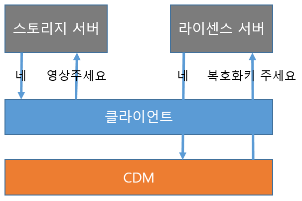

# EME (Encrypted Media Extension)란?
## 목차
1. EME의 정의
2. EME의 동작방식 및 구현
3. EME의 장단점
4. 대표적인 EME

## 1. EME의 정의
EME는 Encrypted Media Extension의 약자로, DRM이 걸려있는 영상 컨텐츠를 사용자가 단말기에서 보안 프로그램 설치 없이 사용할 수 있게 해주는 기술이다.

## 2. EME의 동작방식 및 구현
EME를 적용하기 위해선 암호화된 영상이 저장되어있는 <strong>스토리지 서버</strong> 와 복호화 키가 들어있는 **라이센스 서버** , 그리고 **CDM** 이 기본적으로 필요하다.

넷플릭스를 예로 들어보자. A씨가 넷플릭스에 접속해 로그인을 한다. 인가된 사용자라면 시청 가능한 영상 리스트를 확인할 수 있을 것이다. 아이유 주연의 페르소나를 보고싶었던 A씨는 썸네일을 클릭해 영상을 시청할 수 있는 페이지로 들어간다. 재생 버튼을 누르는 순간 EME 기술이 들어간다.
    
먼저 넷플릭스 **스토리지 서버** 어딘가에 있는 페르소나를 스트리밍으로 조금씩 끊어서 가져올 것이다. 물론 아이유도 저작권료로 먹고 살아야 하기 때문에 영상 스트림은 암호화 되어있을 것이다. 하지만 넷플릭스는 A씨에게 돈을 받았기 때문에 영상을 복호화해 제공해야 한다. 그러기 위해 CDM (Contents Decryption Module) 이라는 기술을 사용한다. CDM에선 복호화 키가 들어있는 **라이센스 서버** 와 통신해 페르소나의 복호화 키를 가져오고 영상 스트림을 복호화해 A씨에게 제공한다.

여기까지가 A씨가 영화를 즐기기 위해 EME가 뒤에서 묵묵히 일해준 내용이다. 그럼 이제 EME를 구현하는 방법에 대해 자세히 알아보자.

먼저 영상을 암호화하는 방법이다.  
영상을 내맘대로 암호화해놓고 CDM더러 복호화 하라고 던져주면 나같아도 화나서 안해줄 것 같다. 이런 불상사를 막기위해 구글에선 **Shaka packager** 라는 암호화 툴을 제공해 주었다.  
이에 대한 사용법은 <a href="https://google.github.io/shaka-packager/html/">여기</a>서 확인하면 된다. 암호화는 했다. 이제 암호화한 영상을 서버에 올렸다고 치자. (서버 구축정도는 할 수 있겠지 EME에 대해 찾아볼 정도면)  
**Shaka packager** 문서대로 암호화를 했다면 복호화 키가 생길 것이고 이걸 라이센스 서버를 구축해서 DB에 넣어준다.

자 우리가 구현해야 할 스토리지 서버와 라이센스 서버 구축이 끝났다. 마지막 CDM만 구현하면 된다.  
아니 근데 생각해보니까 이상하다. 우린 Web에서 영상을 재생할때 video 태그를 통해 재생한다. 그런데 어떻게 스트림 단위로 조금씩 보내오는 영상을 복호화해서 재생하지?  
video 태그 내부를 수정해야 하나? ~~(미친소리다)~~ 전용 플레이어를 만드는 방법이 있지만 그렇게까지 거창하게 하고싶진 않다. 이런 우리를 위해 구글이 EME를 적용할 수 있는 플레이어를 개발해 주었다. (나만의 SI업체 구글)   
바로 **Shaka player** 다. (샤카라는 이름을 자꾸 쓰는데 뭔뜻인진 모르겠다 아시는분은 말해주세요^^)  
그리고 이 플레이어에서 사용할 수 있도록 구글이 만들어놓은 CDM이 있다. 바로 **Widevine** 이라는 친구다.

일단 위에서 말한 Shaka player 사용법에 대한 내용은 <a href="https://shaka-player-demo.appspot.com/docs/api/tutorial-welcome.html">여기</a>에 있다. player 사용법에 대해 보다보면 Widevine 인증서와 관련된 내용이 나올것이다. 아니 이게 뭐야! 하면서 당황하지 마라. (내가 그랬다)  
Widevine을 이용해 컨텐츠를 복호화 하기 위해선 인증서가 필요한데 개인적으로 발급받기는 너무 어렵다. 따라서 미리 인증서를 받아놓고 우리에게 인증서를 나눠주는 좋은 서비스를 하는 업체들이 몇 군데 있다. 난 Pallycon 이라는 서비스를 사용했다. (60일 Trial은 무료다)

이제 라이센스 서버와 Web App이 통신하는 부분만 만들면 된다. 이건 정해진 틀이 없다.  
위에서 페르소나가 너무 보고싶었던 A씨가 넷플릭스에 로그인을 했다면 넷플릭스는 라이센스 서버와 통신해 페르소나의 복호화 키를 보내주면 된다. 복호화는 Widevine이 알아서 해줄 것이다.

## 3. EME의 장단점
* ### 장점
    * 별도의 보안프로그램 설치 없이 DRM 컨텐츠 이용이 가능하다.
    * 다양한 환경에서 컨텐츠를 이용할 수 있다. (Widevine은 크롬에서 동작하는데 크롬이 설치된 어떤 OS에서든 이용이 가능하다)
* ### 단점
    * Widevine에는 보안단계별로 L1, L2, L3가 있는데 가장 낮은 단계인 L1은 이미 뚫렸다.
    * 결국 화면 녹화는 막을 수 없다.
    * 브라우저 별로 기본 지원하는 CDM이 달라 Widevine을 IE에서 사용하기 위해선 플러그인을 설치해야 한다.

## 4. 대표적인 EME
* ### Widevine
    * Google에서 개발
    * Chrome, Android, Firefox, Opera 기본지원
* ### Playready
    * Microsoft에서 개발
    * IE, Edge, Smart TV 기본지원
* ### Fairplay
    * Apple에서 개발
    * Safari, IOS 기본지원
